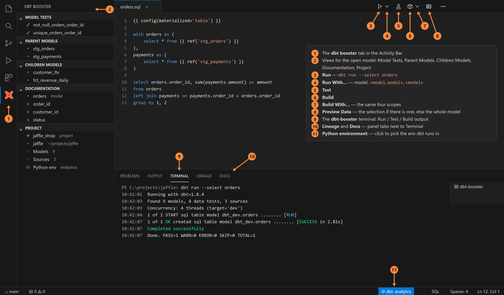
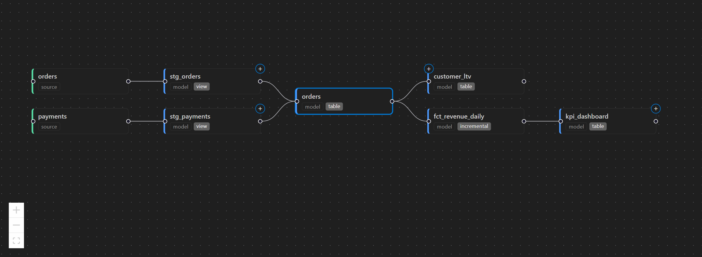
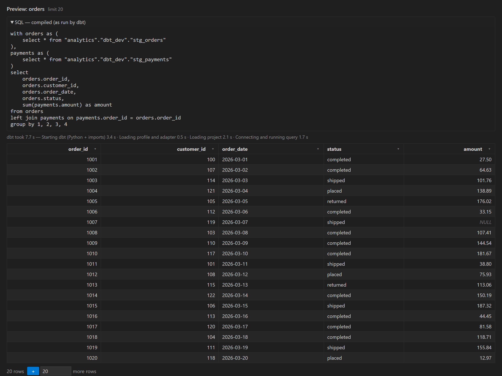
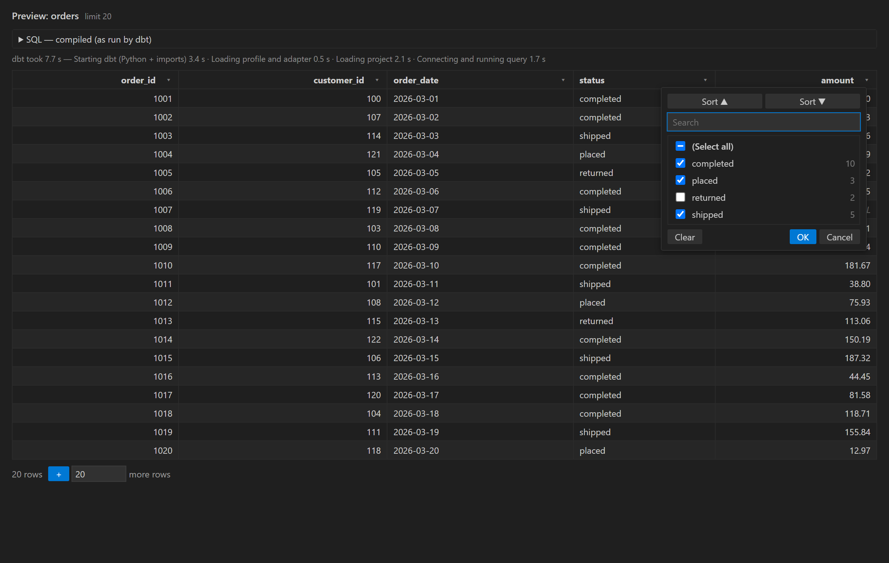
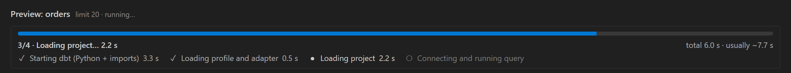
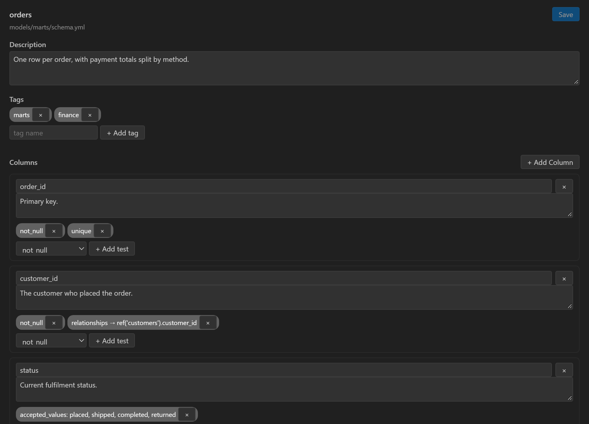

<div align="center">


# dbt booster

**Lineage graph and one-click Run / Test / Build / Preview** — a lean VS Code extension for dbt projects.

[](https://code.visualstudio.com/)
[](https://www.typescriptlang.org/)
[](https://www.getdbt.com/)
[](LICENSE)

</div>

---

## ✨ Features

- 🕸️ **Lineage graph** — an interactive dependency graph for the model you are editing, in the bottom panel.
- ▶️ **One-click Run / Test / Build / Preview** — from the editor title bar or by right-clicking a graph node.
- 🎯 **Run With…** — the model, `+model`, `model+` or `+model+`.
- 🔎 **Data preview** — rows in a table with Excel-style column filters; works on a selected SQL fragment too.
- 📝 **Docs editor** — edit `schema.yml` descriptions, tags, columns and tests in a form.
- 🔒 **No AI, no telemetry, no cloud account** — it reads `target/manifest.json` and runs your own `dbt` CLI, which resolves `profiles.yml` as usual.

## What you get in the window



1. The **dbt booster** tab in the Activity Bar.
2. Its views for the open model: Model Tests, Parent Models, Children Models, Documentation, Project.
3. **Run**, 4. **Run With…** (model, `+model`, `model+`, `+model+`).
5. **Test**.
6. **Build**, 7. **Build With…** (same four scopes).
8. **Preview Data** — the selection if there is one, otherwise the whole model.
9. The **dbt-booster** terminal that Run / Test / Build write to.
10. **Lineage** and **Docs** tabs in the bottom panel, next to Terminal.
11. The Python environment in the status bar (bottom right): click it to pick the env dbt runs in.

The buttons appear in the title bar of any `.sql` file inside a dbt project.

## Lineage graph

Open a model and the **Lineage** panel (bottom Panel area, next to Terminal) shows two levels up
and two levels down. Click a node to open its file, Shift-click to re-centre on it, and use the
**＋** handles to reveal one more level. **Refresh** re-runs `dbt parse`.



Right-click a model node to run dbt on it without opening the file.


## Run, Test, Build, Preview

The editor title bar gets **Run**, **Test**, **Build** and **Preview Data** buttons for the
model you have open. Run and Build also offer the model with its upstream (`+model`),
downstream (`model+`) or both (`+model+`).

Run / Test / Build go to one reused terminal named `dbt-booster`. While dbt works, a progress
notification shows the current stage, the elapsed seconds, and how many models or tests are
done out of how many.

## Data preview

**Preview Data** runs `dbt show` for the model and opens the rows in a table. Select a piece of
SQL first, or right-click it and choose **▦ Preview Selected SQL**, to preview just that fragment
(`dbt show --inline`; `{{ ref() }}` still resolves).

- The collapsible **SQL** block shows the compiled SQL dbt actually ran.
- **▾** in a column header opens a filter like a spreadsheet's: every value in the column with
  its row count, search, select-all, sort.
- **+** at the bottom loads more rows (20 by default, or any number you type).





While dbt starts up, the panel shows which stage it is in and how long each one took:



## Docs editor

The **Docs** panel edits the open model's entry in `schema.yml`: description, tags, columns and
per-column tests (`not_null`, `unique`, `relationships`, `accepted_values` or a custom test).
Only that model's block is rewritten; the rest of the file is left as it was.



## Sidebar

The **dbt booster** view in the Activity Bar shows the project (name, resource counts, Python
environment) and, for the open model, its tests, parents, children and documented columns.

## Setup

- A dbt project (a folder with `dbt_project.yml`) in the workspace.
- dbt-core 1.5 or newer (1.5 is needed for previewing a selection).
- One setting: **`dbtBooster.dbtPath`**, the dbt command to run (default `dbt`). If dbt lives in
  a conda env or a virtualenv, click the Python environment in the status bar and pick it; the
  extension writes the path for you. `uv run dbt` style commands work too.

If `target/manifest.json` is missing, the extension offers to run `dbt parse`.

**Diagnose dbt Performance** (Command Palette) times dbt's startup, parse and a trivial query,
and prints where the time goes to the **dbt booster** output channel.

## Running from source

Requirements: Node.js 18+.

```sh
npm install
npm run build       # out/extension.js and out/webview.js
npm test            # vitest
npm run package     # dbt-booster-<version>.vsix
```

Press **F5** in VS Code to open an Extension Development Host on the bundled `sample/jaffle`
project.

## License

MIT — see [LICENSE](./LICENSE). This is a clean-room implementation; no code is taken from
other dbt extensions.
